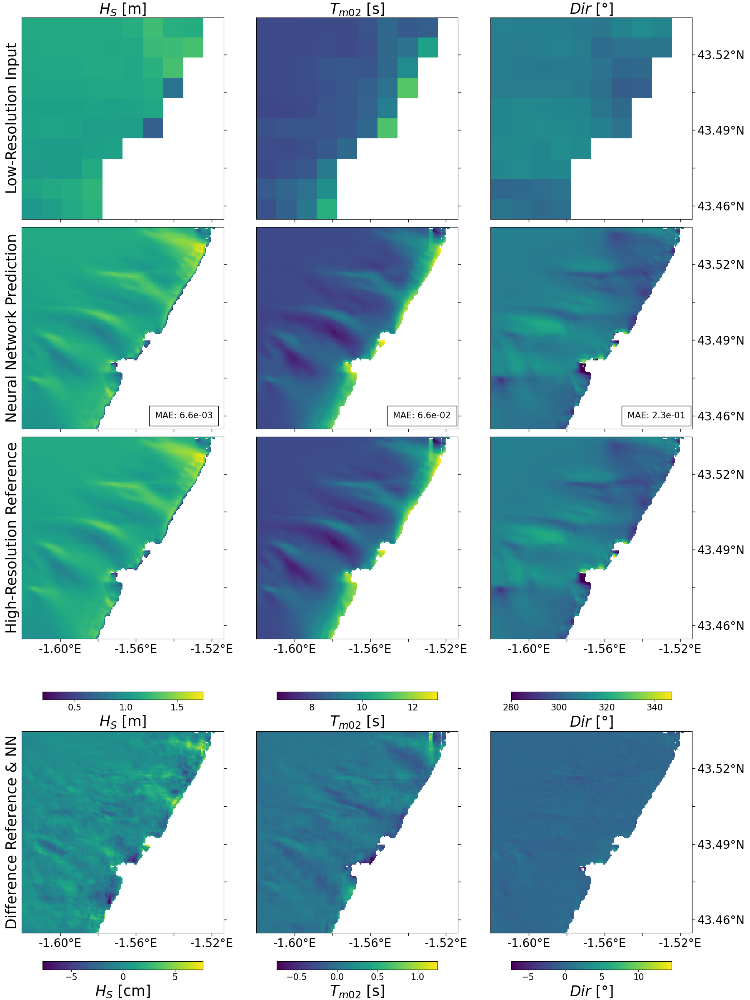

# SR_on_SWAN

## General Information

Code repository for the workflow presented in the article "A neural network super-resolution approach for the reconstruction of coastal sea states"
(J. Kuehn, S. Abadie, V. Roeber, B. Liquet, 2022). 

It contains the SWAN script files that were used to produce the low- and high-resolution results. The pre-processing of the data and the training
of the neural network are done with Python and are saved as Jupyter Notebooks. 

The Run\_Training.py is a simple python script that runs Train\_Model.py with the chosen parameters. The four different network architectures / 
modelling approaches can be found in Models.py. 

## Data
Given the large site of the data set that the neural network was trained on, it is not contained in this repository and has to be downloaded
seperately [here](https://nuage.univ-pau.fr/s/fRMeRxnkj7TyERr). Only the time series extracted at the three locations (see article), along with the pre-processed bathymetry data obtained from the Digital Terrain Model ”MNT bathymétrique de façade Atlantique” provided by the French Service Hydrographique et Océano-graphique de la Marine (SHOM) are included in the repository. Note that certain notebooks / scripts, might not work properly without the downloaded data. 

Also, the Convergence Analysis folder contains only the scripts to give an idea of how it was implemented.

Please contact jannik.kuhn@univ-pau.fr in case of questions or further material.

